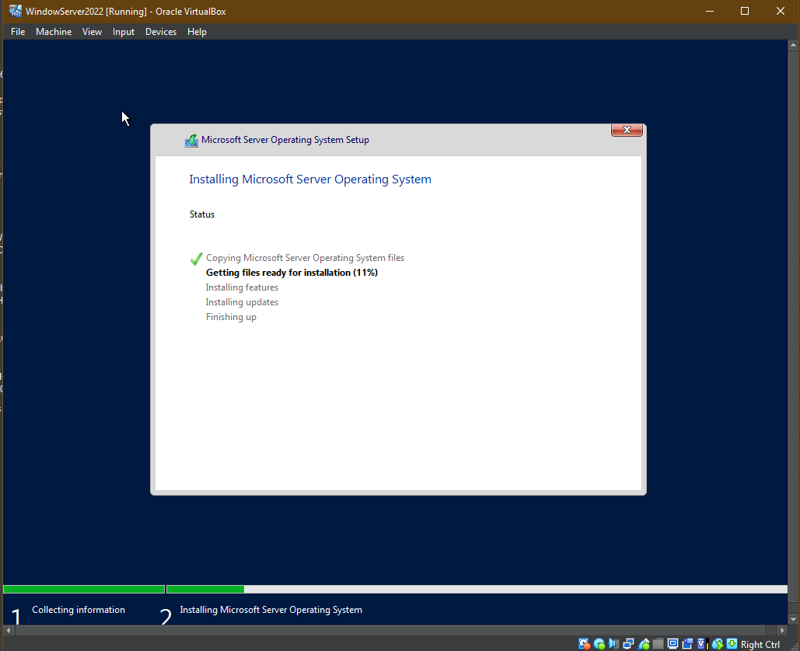
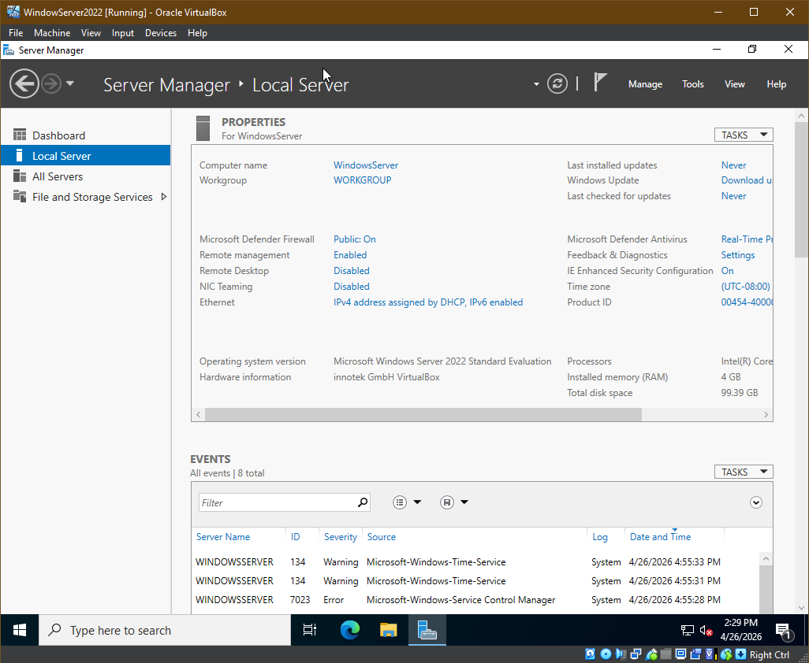

<h1>Setup Virtual Lab Environment</h1>

<h2>Description</h2>
The project demonstrates the setup and deployment of a Windows Server 2022 virtual machine using Oracle VM VirtualBox for lab and testing purposes

 

<h2>Overview</h2>
Created a virtualized server environment to stimulate real-world system administration tasks and support hand-on learning for IT infrastructure concepts.

 

<h2>Key Steps:</h2>
- <b>Initialized a new virtual machine in VirtualBox</b>
 
- <b>Configured system resources (CPU, RAM, storage)</b>
 
- <b>Mounted the Windows Server 2022 ISO image</b>
 
- <b>Completed OS installation through the VM setup process</b>

<h2>Purpose:</h2>
The lab servers as a foundational environment for practicing system administration, Active Directory configuration, and enterprise-level server management task

<h2>Program walk-through:</h2>

- <b>Launch the VirtualBox</b>
- <b>Create New VM</b>
- <b>Add configurations ( VM name, VM folder, ISO image, etc )</b>
 

- <b>Create VM</b>
  

 

- <b>Install Windows via Windows Install Wizard in the VM</b>

 

- <b>VM will start up and automcatically open Server Manager</b>

 
