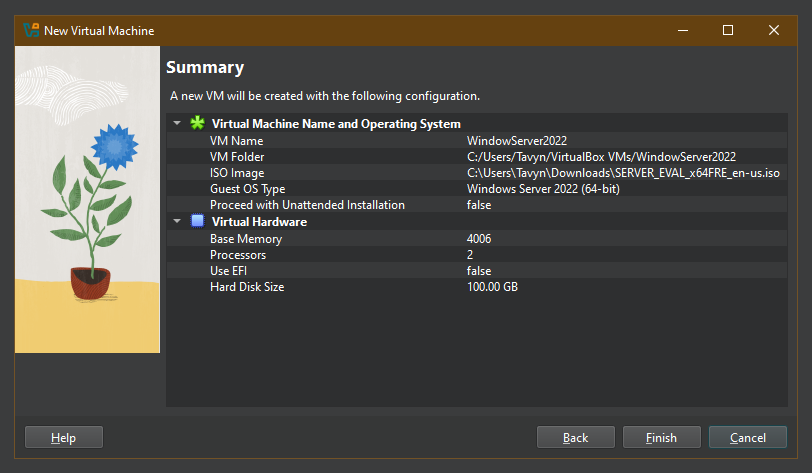

<h1>Active Directory Setup</h1>

<h2>Description</h2>

<br />

<h2>Resources needed:</h2>

- <b>Laptop/Desktop</b>
- <b>Minimum 4GB of RAM</b>
- <b>Minimum 32 GB of storage</b>

<h2>Files and Programs needed:</h2>

- <b>Windows Server 2022 or 2025 iso<br/>
- <b>Virtual Machine software<br/>

<h2>Languages and Utilities Used</h2>

- <b>PowerShell</b> 

<h2>Environments Used </h2>

- <b>Oracle Virtual Box </b>

<h2>Program walk-through:</h2>


- <b>Launch the VirtualBox</b>
- <b>Launch the VirtualBox</b>
<br />
<p align="center">
Add configurations ( VM name, VM folder, ISO image, etc )

<br />
<br />
<br /> 
Select the disk:  <br/>

<br />
<br />
Enter the number of passes: <br/>

<br />
<br />
Confirm your selection:  <br/>

<br />
<br />
Wait for process to complete (may take some time):  <br/>

<br />
<br />
Sanitization complete:  <br/>

<br />
<br />
Observe the wiped disk:  <br/>

</p>

<!--
 ```diff
- text in red
+ text in green
! text in orange
# text in gray
@@ text in purple (and bold)@@
```
--!>
